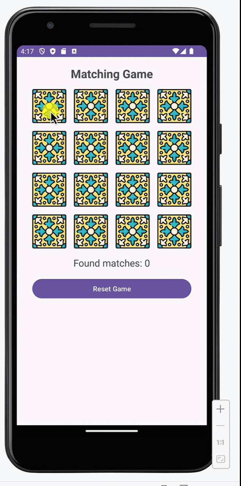

<h1 align="center">🎯 Matching Game - Flip & Match Fun!</h1>

A tile-based memory game where you flip cards to find matching pairs 🍌🍂

---

## 📱 App Preview

> A quick peek into the real game UI:

  

---

## 🎮 Game Description

Welcome to the **Matching Game**, a colorful and engaging memory challenge!  
Flip two tiles at a time and try to find all matching pairs hidden behind beautifully designed cards.

🌟 Perfect for all ages  
🧠 Trains your short-term memory  
🎨 Eye-catching visuals (bananas, leaves, patterns, etc.)

> Featuring a fun reset feature so you can keep playing endlessly!

---

## 🚀 How It Works

- Tap on a card to reveal the image.
- Tap a second card to find its pair.
- If they match – they stay flipped!
- If not – they flip back over.
- Score increases with each correct match!

---

## 🔧 Tech Specs

| Feature         | Details                       |
|-----------------|-------------------------------|
| 🛠 Language      | Java                          |
| 🧱 Architecture  | Activity-based (MVC style)     |
| 🎨 UI Framework  | Android XML Layouts           |
| 📦 Assets        | PNG images for tile faces     |
| 🧪 Tested On     | Android Emulator (Pixel)      |

